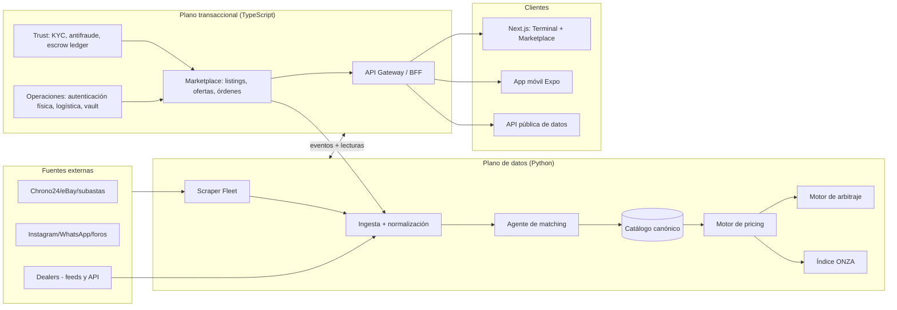

# 03 · Arquitectura del sistema

## Principios

1. **Monolito modular primero, microservicios cuando duela.** Un equipo de <10 personas (y sesiones de Claude Code) no debe pagar el impuesto de microservicios en el MVP. El monorepo define módulos con fronteras duras (paquetes con contratos tipados); la extracción a servicio es mecánica cuando el tráfico lo exija. Excepción: **el plano de datos (scraping/ML) se separa del plano transaccional desde el día 1** — lenguajes, cargas y ritmos de deploy distintos.
2. **El grafo de instrumentos es el corazón.** Todo (listings, ventas, precios, alertas, órdenes) referencia un `instrument_id` canónico. Los listings son cotizaciones; el instrumento es el ticker.
3. **Event-driven donde importa.** Cada cambio observado en el mercado (nuevo listing, cambio de precio, venta detectada) es un evento inmutable en un log. Los consumidores (pricing, arbitraje, alertas, índice) son proyecciones sobre ese log. Esto da el "versionado histórico" gratis.
4. **Dinero con ledger propio.** Escrow, fees y payouts viven en un ledger contable de doble entrada dentro de nuestra base — los proveedores de pago son adaptadores, nunca la fuente de verdad.

## Vista de contexto



## Componentes

### Plano de datos (`data/` — Python)
| Componente | Responsabilidad |
|---|---|
| `scraper-fleet` | Workers Playwright/HTTP distribuidos, rotación de proxies, fingerprints, scheduling incremental por fuente |
| `ingestion` | Validación, normalización (moneda, condición, box&papers), deduplicación, detección de cambios, event log versionado |
| `matcher` | Entity resolution: listing → instrumento canónico (reglas + embeddings + LLM para colas difíciles) |
| `catalog` | Catálogo canónico de instrumentos: marcas, familias, referencias, atributos, imágenes de referencia |
| `pricing` | Fair value con intervalos de confianza; features de mercado (volatilidad, liquidez, spread); batch + on-demand |
| `arbitrage` | Detección de spreads netos entre venues/regiones; scoring de oportunidades |
| `index` | Índice ONZA 50 (metodología repeat-sales), sub-índices por marca/categoría |

### Plano transaccional (`services/core` — TypeScript, monolito modular)
| Módulo | Responsabilidad |
|---|---|
| `identity` | Cuentas, sesiones, roles (comprador, vendedor, dealer, perito, admin), KYC estados |
| `marketplace` | Listings propios, ofertas/contraofertas (bids), órdenes, chat transaccional |
| `escrow` | Ledger de doble entrada, estados de fondos, integración con adaptadores de pago, payouts |
| `trust` | Scoring antifraude, límites, colas de revisión, reporting AML |
| `authentication-ops` | Workflow de autenticación física: recepción, peritaje, certificado, pasaporte digital |
| `logistics` | Etiquetas, tracking, seguros de envío, aduanas |
| `vault` | Custodia: posiciones, transferencias de propiedad in-vault, statements (Fase 3) |
| `notifications` | Alertas de precio, push/email/WhatsApp Business API |
| `billing` | Suscripciones (Terminal Pro, Dealer), medición de API |

### Clientes (`apps/`)
- `web`: Next.js — el Terminal (gráficos, screener, watchlists) y el Marketplace comparten shell.
- `mobile`: Expo/React Native — alertas y gestión de portafolio primero; compra completa después.
- `admin`: back-office de operaciones (colas de matching, revisión antifraude, workflow de peritaje).

### Contratos y eventos
- Contratos API tipados end-to-end (OpenAPI generado desde el código + clientes generados).
- Bus de eventos con esquemas versionados: `listing.observed`, `listing.price_changed`, `listing.delisted`, `sale.detected`, `instrument.fair_value_updated`, `arbitrage.opportunity_found`, `order.placed`, `escrow.funded`, `item.authenticated`, `vault.ownership_transferred`.

## Modelo de datos (núcleo)

```
brands ─< families ─< instruments (ticker canónico: ej. ROLEX-126710BLRO)
instruments ─< listings (venue, seller, precio, condición, box&papers, url, estado)
listings ─< listing_versions (SCD-2: cada cambio observado, con timestamps)
instruments ─< sales (precio de cierre, fuente: propia/subasta/reportada, confianza)
instruments ─< market_snapshots (serie temporal diaria: fair value, spread, liquidez, volumen)
instruments ─< bids (ofertas de compra con pre-autorización)
orders ── escrow_accounts ── ledger_entries (doble entrada)
items (pieza física con serial) ── passports (historial: peritajes, dueños, ubicación)
```

Decisiones:
- `listings` siempre conserva el crudo original (`raw_payload JSONB`) — re-procesable cuando mejore el matcher.
- `sales` distingue **fuente y calidad** del precio (cierre propio = oro; subasta pública = plata; precio de lista al delist = bronce, inferido).
- Series temporales de mercado en tablas particionadas por tiempo (TimescaleDB) — un snapshot diario por instrumento activo.

## Estructura del monorepo

```
onza/
├── apps/
│   ├── web/                  # Next.js: Terminal + Marketplace
│   ├── mobile/               # Expo
│   └── admin/                # Back-office operaciones
├── services/
│   ├── core/                 # Monolito modular TS (NestJS)
│   │   └── src/modules/{identity,marketplace,escrow,trust,authentication-ops,logistics,vault,notifications,billing}
│   └── gateway/              # BFF/API Gateway + API pública de datos
├── data/                     # Plano de datos (Python)
│   ├── scraper-fleet/
│   ├── ingestion/
│   ├── matcher/
│   ├── catalog/
│   ├── pricing/
│   ├── arbitrage/
│   └── index/
├── packages/                 # Compartidos TS
│   ├── contracts/            # Tipos de API + esquemas de eventos (zod)
│   ├── ui/                   # Design system (shadcn + charts)
│   ├── db/                   # Esquema + migraciones (drizzle)
│   └── config/               # eslint, tsconfig, tooling
├── infra/
│   ├── terraform/            # AWS: red, ECS, RDS, etc.
│   ├── docker/               # Dockerfiles, compose local
│   └── github/               # Workflows CI/CD
└── docs/                     # Este paquete + ADRs
```

Reglas del monorepo:
- Turborepo + pnpm para TS; uv + un `pyproject` por paquete para Python.
- `packages/contracts` es la única frontera permitida entre planos: el plano de datos publica eventos y expone lecturas; nunca escribe en tablas del core.
- Cada módulo tiene `README.md` con su contrato — es la unidad de prompt para Claude Code.

## Flujos críticos

**Compra con escrow (Capa 2):**
`oferta aceptada → escrow.funded (pago retenido) → vendedor envía a ONZA PTY → peritaje → item.authenticated → envío a comprador → confirmación/72h → escrow.released → payout − fee`
Implementado como workflow durable (Temporal): cada transición sobrevive reinicios, tiene timeouts y compensaciones (devolución si falla peritaje).

**Ingesta de mercado (Capa 1):**
`scheduler → scrape → normalize → dedupe → match → evento listing.observed/price_changed → pricing recalcula instrumentos afectados → arbitraje evalúa → alertas a watchlists`
Presupuesto de latencia: fuente de alta liquidez re-visitada cada 6-24h; pipeline completo <15 min desde observación hasta alerta.

## Seguridad y compliance (transversal)

- PII cifrada a nivel de columna; documentos KYC en bucket aislado con acceso auditado.
- Toda acción de admin sobre dinero o identidad pasa por audit log inmutable.
- Umbrales AML configurables (ticket > $10k → verificación de origen de fondos reforzada); reporting a la UAF panameña como workflow, no como proceso manual.
- Rate limiting y detección de scraping *hacia nosotros* (nuestros datos son el moat).
