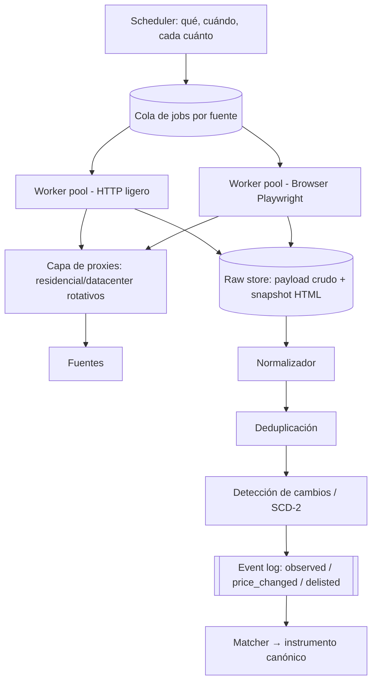

# 05 · Motor de datos y scraping

> El scraping no es el producto: es el **arranque en frío** del dataset. El estado maduro se apoya en precios de cierre propios, datos give-to-get de dealers y resultados de subastas. Pero sin un motor de ingesta serio, no hay Capa 1, así que se construye bien.

## Jerarquía de fuentes (por valor y legalidad)

| Tier | Fuente | Valor del dato | Riesgo legal | Prioridad |
|---|---|---|---|---|
| S | **Transacciones propias (ONZA Market)** | Precio de cierre real | Ninguno | Máxima (pero llega en Capa 2) |
| A | **Resultados de subastas** (Sotheby's, Christie's, Phillips, casas regionales) | Cierre real, público | Bajo (datos públicos) | Alta desde MVP |
| A | **Feeds de dealers give-to-get** | Inventario + a veces cierres | Ninguno (consentido) | Alta — es también go-to-market |
| B | **Chrono24, eBay, WatchBox, marketplaces** | Precio de lista + histórico | Medio (ToS, pero datos fácticos públicos) | Media |
| B | **WatchCharts / agregadores** | Índices y series (referencia/benchmark) | Medio | Media (benchmark, no re-publicar) |
| C | **Instagram / foros / grupos públicos** | Señal de oferta y sentimiento; precios "DM" | Medio-alto | Baja (señal, no verdad de precio) |

Política: priorizar S/A; tratar B como referencia con respeto a robots.txt y rate limits razonables; C solo como señal cualitativa. **El riesgo legal se presupuesta explícitamente** y se revisa con abogado antes de escalar cualquier fuente B/C.

## Arquitectura del fleet de scraping

### Componentes

**Scheduler adaptativo.** No todo se re-scrapea igual. Frecuencia = función de (liquidez del segmento, tasa de cambio histórica, costo de la fuente). Un Submariner en Chrono24 se revisa cada 6-12h; un nicho ilíquido, semanal. Presupuesto de requests por fuente para no gatillar defensas.

**Dos pools de workers.** HTTP directo (barato, rápido) para fuentes que lo permiten; browser headless (Playwright) solo cuando hay JS/anti-bot. Regla de costos: nunca lanzar un navegador si un GET resuelve.

**Rotación de proxies y fingerprinting.** Pool de proxies residenciales + datacenter con health-checking; rotación por sesión; fingerprints de navegador coherentes (UA, viewport, timezone, idioma es-PA/es-MX según fuente); throttling humano-plausible con jitter.

**Anti-bot y CAPTCHA.** Estrategia en capas: (1) evitar detección (rate humano, proxies limpios, sesiones persistentes) antes que resolver; (2) para CAPTCHA donde el ToS/legislación lo permita, servicio de resolución; (3) **si una fuente exige romper defensas activamente, se degrada a "solo referencia manual" — no se arriesga la empresa por un dato.** Circuit breaker por fuente: si sube el rate de bloqueos, se pausa y alerta.

**Raw store inmutable.** Todo scrape guarda el payload crudo + snapshot. Cuando el matcher/normalizador mejora, se re-procesa el histórico sin volver a scrapear. Es la póliza de seguro del dataset.

## ETL y normalización

Pipeline determinista y testeable (cada paso es una función pura con fixtures):

1. **Parse** → extracción estructurada del payload (selectores + fallback a LLM extractor para layouts que rompen).
2. **Normalize**:
   - Moneda → USD (tasa del día, guardada).
   - Condición → escala canónica (New / Unworn / Excellent / Good / Fair) con mapa por fuente.
   - Box & papers → flags booleanos (`has_box`, `has_papers`, `year`).
   - Marca/modelo → texto limpio (para el matcher).
   - Vendedor → entidad (dealer conocido vs particular vs desconocido).
3. **Validate** → reglas de sanidad (precio en rango plausible para la categoría; descartar/flag outliers a revisión).
4. **Dedupe** → misma fuente + mismo vendedor + mismas fotos/serial = un listing; misma pieza en dos fuentes = dos cotizaciones del mismo instrumento, no un duplicado.

## Deduplicación y matching de productos

Dos problemas distintos:

- **Dedupe de listings** (¿es el mismo anuncio?): hash de imágenes (pHash), URL canónica, serial si existe, similitud de texto. Barato y determinista.
- **Matching a instrumento** (¿qué ticker es?): ver doc 06, agente de matching. Cascada: exact match de referencia → reglas → embeddings (texto+imagen) → LLM para la cola difícil, con confianza y cola de revisión humana bajo umbral.

## Versionado histórico (SCD tipo 2)

Cada listing tiene versiones: cada cambio observado (precio, condición, estado) crea una fila con `valid_from`/`valid_to`. Esto permite responder "¿cuánto tiempo estuvo listado a $9,500 antes de bajar a $8,900?" — señal directa de liquidez y de si el precio de lista es real. El delisting se interpreta (¿vendido? ¿retirado?) con heurísticas + confirmación cuando es fuente propia.

## Detección de cambios y alertas

El event log alimenta:
- **Recalcular pricing** del instrumento afectado.
- **Evaluar arbitraje** (nuevo listing barato vs fair value / vs otra región).
- **Disparar alertas** a watchlists ("bajó de precio", "nuevo listing bajo fair value", "spread PTY vs global > X%").

## KPIs del motor de datos

| KPI | Objetivo MVP |
|---|---|
| Cobertura de instrumentos activos con ≥3 comparables | ≥60% del catálogo prioritario |
| Precisión de matching (auto, sin revisión) | ≥95% precision, con cola para el resto |
| Frescura (edad mediana del dato en instrumentos líquidos) | <24h |
| Costo por 1k listings ingestados | Presupuestado y en dashboard |
| Tasa de bloqueo por fuente | <2%, con circuit breaker |
